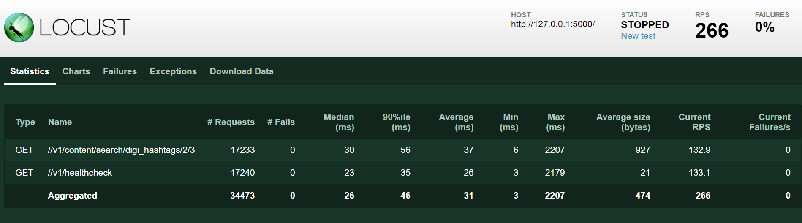
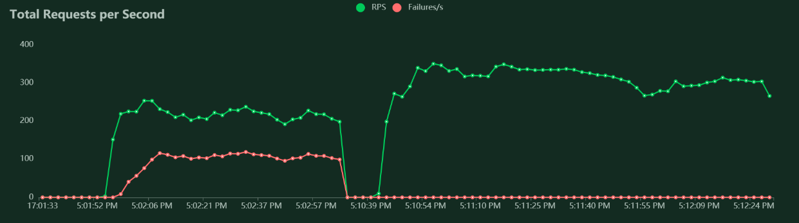
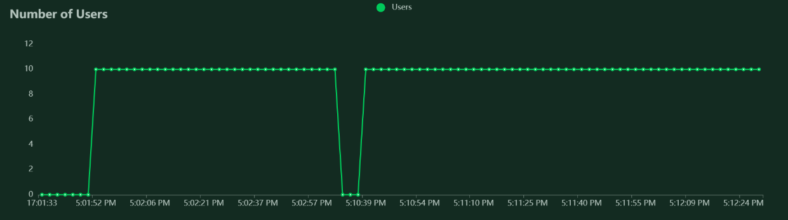

<h1 align="center">
    <a>Flask based microservice</a>
</h1>
<p align="center"><small>Flask based microservice with GraphQL, Performance testing and tuning, Asynchronous and Synchronous demonstrations</small></p>

<div align="center">
  <a href="https://github.com/schatterjee0010/micro-flask-template/discussions">Ask a Question</a>
</div>

<div align="center">
<br />
</div>

<details open="open">
<summary>Table of Contents</summary>

- [About](#about)
  - [Tech Stack](#tech-stack)
- [Getting Started](#getting-started)
  - [Prerequisites](#prerequisites)
  - [Usage](#usage)
    - [Manual setup](#manual-setup)
  - [Run The App](#run-the-app)
    - [Using Docker](#using-docker)
  - [Performance Benchmarking](#performance-benchmarking)
  - [Takeaways](#takeaways)
  - [References](#references)

</details>

---

## About


### Tech Stack
- Flask[async]
- AioFlask
- Docker
- Elasticsearch[async]
- HTML5
- Bootstrap
## Getting Started

### Prerequisites
- Install `docker`
- Install `python==3.9.6`
- Install `aioFlask` # it makes async compatible with other async libraries like `AsyncElasticsearch`
- Install requirements.txt dependent libraries
### Usage
Deployment with `uvicorn` 
#### Manual Setup
- `cd flask-app`
- `docker-compose up` <small>it will set up single node Elasticsearch cluster with Kibana enabled</small>
- `python app/app.py` <small>it will start the flask app</small>

### Run the App
#### Locally
- Setup python virtual environment
```commandline
python -m venv py3venv
```
#### Using Docker
```commandline
docker build --rm --tag flask-app .
docker run --rm --net flask-app_elastic --publish 5000:5000 flask-app
```

### Performance Benchmarking
```commandline
locust -f performance_test/locustfile.py --csv=performance_test/stats/flask-app
```
**Locust Performance Stats**: <i>10 Users/10 Spawned/sec</i>

_1630150302.png "Response Time")



### Takeaways
- Web Server Gateway Interface (WSGI) is incompatible with async globals.
- With Flask and AsyncElasticsearch client to work, we must make sure to use Async Server Gateway Interface (ASGI) along with `aioFlask`.
- Sample errors with `Flask[async]` and `AsyncElasticsearch` integrations (without using `aioFlask`)
```
Error occurred: ConnectionError(Event loop is closed) caused by: RuntimeError(Event loop is closed)
Error occurred: Session and connector has to use same event loop
Error occurred: '<' not supported between instances of 'AIOHttpConnection' and 'AIOHttpConnection' 
```


### References
- [Elasticsearch on docker](https://www.elastic.co/guide/en/elastic-stack-get-started/current/get-started-docker.html)
- [Flask Error Handling](https://flask.palletsprojects.com/en/2.0.x/errorhandling/)
- [AioFlask](https://opensourcelibs.com/lib/aioflask)